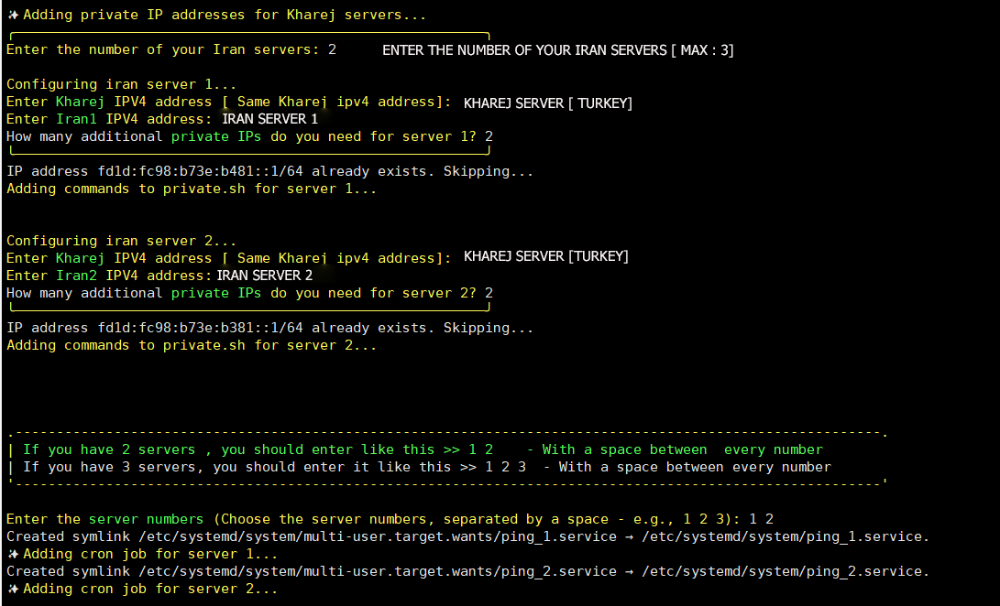

  <a href="/README.md">English</a> | <a href="/README-Fa.md">فارسی</a>

------------------------------------------

  <picture>
    <source media="(prefers-color-scheme: dark)" srcset="./Media/Pic.png">
    
  </picture>

<h2 align="center"><strong>تانل 6TO4 - پرایوت ایپی
   
امکان تانل بین 5 سرور خارج و 1 ایران و برعکس
</strong></h2>

 

<blockquote dir="rtl">
  <strong>توضیحات :</strong>
  
  - این پروژه فقط برای یادگیری شخصی و ارتباطات است، لطفاً برای مقاصد غیرقانونی استفاده نکنید .
  - لطفاً آن را در محیط‌های تولیدی به کار نبرید .
</blockquote>

   
  

  <h2>🔧 نصب و بروزرسانی</h2>

  <pre>
apt install curl -y && bash <(curl -Ls https://raw.githubusercontent.com/Azumi67/6TO4-PrivateIP_multipleSERVERS/main/6to4.sh --ipv4)
  </pre>
   

## 🌟 ویژگی‌ها 

  - ایجاد تونل 6to4 بین چندین سرور [Anycast] & [PrivateIP]   
  - تونل بین 5 سرور خارجی و 1 سرور ایرانی، و بالعکس   
  - قابلیت استفاده از IP در سرورهای دیگر (توصیه نمی‌شود) [Anycast]   
  - استفاده از `cronjob` به جای `service`   
  - قابلیت حذف تونل‌ها   
  - پس از تنظیم این تونل، می‌توانید از IPهای تولید شده برای تونل اصلی یا فوروارد پورت استفاده کنید   
  - سازگار با بارگذاری متوازن در FRP   
  - قابلیت ایجاد چندین IP خصوصی برای سرورهای شما

 

## 💡 نکات

  
برای مشاهده نکات کلیک کنید

 
  <ol style="text-align: right;">
    <li><strong>سرورهای خارجی را ابتدا پیکربندی کنید</strong>
      
ابتدا سرورهای خارجی خود را پیکربندی کنید، سپس سرور ایرانی را پیکربندی کنید.

    </li>

  <li><strong>تونل بین 5 سرور خارجی و 1 سرور ایرانی</strong>  
      
می‌توانید یک تونل بین 5 سرور خارجی و 1 سرور ایرانی ایجاد کنید، و بالعکس.

    </li>

  <li><strong>استفاده از IPهای خصوصی برای لود بالانسینگ</strong>  
      
این IPهای خصوصی می‌توانند برای لود بالانسینگ استفاده شوند که به زودی آن‌ها را ارائه خواهم داد.

    </li>

  <li><strong>رفع مشکلات پینگ بین سرورها</strong>  
      
اگر در هنگام ساخت تونل، پینگ بین 5 سرور خارجی و 1 سرور ایرانی کار نمی‌کند، تمامی سرورها را یک‌باره ریبوت کنید. این کار معمولاً مشکل را حل می‌کند.

    </li>

  <li><strong>راه‌حل جایگزین برای مشکلات اتصال</strong>  
      
اگر مشکلی در اتصال سرورها وجود داشته باشد (مثلاً در تونل 5 سرور خارجی و 1 سرور ایرانی، سرور 3 مشکل دارد)، تنها سرور 3 را Uninstall کرده و دوباره آن را پیکربندی کنید.

    </li>

  <li><strong>اطمینان از استفاده صحیح از IPها</strong>  
      
اطمینان حاصل کنید که از IP صحیح برای هر سرور استفاده می‌کنید تا از بروز خطاها جلوگیری کنید.

      
به‌طور مثال، وقتی سرور خارجی 1 و سرور ایرانی را پیکربندی می‌کنید، باید از IP سرور ترکیه برای سرور خارجی 1 استفاده کنید و برای سرور خارجی 2 و سرور ایرانی از IP سرور آلمان استفاده کنید.

    </li>

  <li><strong>SSH یا پینگ از سرور ایرانی به سرورهای خارجی</strong>  
      
قبل از راه‌اندازی تونل 6to4، مطمئن شوید که می‌توانید از سرور ایرانی به سرورهای خارجی SSH بزنید یا پینگ بگیرید.

    </li>

  <li><strong>IPهای خصوصی برای هر سرور خارجی</strong>  
      
در پیکربندی سرور ایرانی، برای هر سرور خارجی یک IP خصوصی منحصر به فرد خواهید داشت. اطمینان حاصل کنید که این IPها را به‌درستی وارد کنید.

    </li>

  <li><strong>اگر تونل پنل به پنل است</strong>  
      
برای تونل‌های پنل به پنل، تنها نیاز به IP سرور خارجی دارید.

    </li>

  <li><strong>اگر از تونل‌های FRP استفاده می‌شود</strong>  
      
برای تونل‌های FRP، به IPهای خصوصی هر سرور خارجی در سرور ایرانی نیاز دارید.

    </li>

  <li><strong>باز کردن IPهای خصوصی</strong>  
      
اگر تونل پنل به پنل است، باید IPهای خصوصی را باز کنید.

    </li>

  <li><strong>آزمون و خطا برای پیکربندی تونل</strong>  
      
با آزمون و خطا می‌توانید تونل‌ها را به‌درستی پیکربندی کنید.

    </li>
  </ol>

 

##  📜 نحوه استفاده از اسکریپت

  
برای مشاهده دستورالعمل‌ها کلیک کنید

  
  ### 🛠 ایجاد یک IP خصوصی بین یک سرور خارجی و یک سرور ایرانی
  

    
برای مشاهده جزئیات کلیک کنید

    
   > 

      - ایجاد یک IP خصوصی: از سرور خارجی شروع کنید.  
      - آدرس‌های IPv4 سرورهای خارجی و ایرانی را وارد کنید.  
      - Subnet /64 را وارد کنید.  
      - تعداد IPهای خصوصی مورد نیاز خود را مشخص کنید.  
      - IPهای تولید شده را در Notepad ذخیره کنید تا از آن‌ها در تونل استفاده کنید.  
      - IP خصوصی و سرویس پینگ به طور خودکار ایجاد خواهد شد تا از اختلالات جلوگیری شود.  
      - مراحل مشابه را برای سرور ایرانی تکرار کنید.  

  

   

  ### 🛠 ایجاد یک IP خصوصی بین یک سرور خارجی و 5 سرور ایرانی
  

    
برای مشاهده جزئیات کلیک کنید

> 

    🌍 پیکربندی سرور خارجی
    
    - در این تونل، از 2 سرور ایرانی و 1 سرور خارجی استفاده می‌کنیم.  
    - همیشه پیکربندی تونل را از سرور خارجی شروع کنید.  
    - تعداد سرورهای ایرانی خود را وارد کنید (حداکثر تعداد مجاز 5 سرور است).  
    - برای هر سرور ایرانی، همان IP خارجی (مثلاً ترکیه) را وارد کنید.  
    - توجه: اگر از IP ایروان برای سرور ایرانی 1 استفاده کردید، همان IP ایروان را برای پیکربندی سرور ایرانی 1 وارد کنید.  
    - به عنوان مثال، اگر از IP ایروان برای سرور 1 و IP شاتل برای سرور 2 استفاده کردید، در پیکربندی سرور ایرانی، سرور 1 باید از IP ایروان و سرور 2 از IP شاتل استفاده کند، در غیر این صورت تونل برقرار نخواهد شد.  
    - تعداد IPهای مورد نیاز برای هر سرور را وارد کنید.  
    - برای ایجاد cronjob برای سرورها، تعداد سرورها را با فاصله وارد کنید. به عنوان مثال، اگر 2 سرور ایرانی دارید، آن را به صورت (2 1) وارد کنید.  

    ---

> 

    🇮🇷 پیکربندی سرور ایرانی 1

    - حالا باید هر سرور ایرانی را به طور جداگانه پیکربندی کنید.  
    - برای مثال، اگر برای سرور ایرانی 1 از IP ایروان استفاده کردیم (از تصویر قبلی)، باید همین IP ایروان را در اینجا نیز برای سرور ایرانی 1 استفاده کنیم.  
    - IP سرور خارجی برای همه سرورهای ایرانی یکسان باقی می‌ماند زیرا تونل از 3 سرور ایرانی و 1 سرور خارجی تشکیل شده است.  
    - تعداد IPهای مورد نیاز برای این سرور را وارد کنید.  

    ---

> 

    🇮🇷 پیکربندی سرور ایرانی 2

    - برای سرور ایرانی 2، آن را همانطور که برای سرور ایرانی 1 توضیح داده شد، پیکربندی کنید.  
    - IP سرور خارجی برای همه سرورهای ایرانی یکسان است.  
    - تعداد IPهای مورد نیاز برای این سرور را وارد کنید.  
    - اگر سرور ایرانی سومی دارید، آن را به همین ترتیب پیکربندی کنید.  
    - برای حذف تونل‌ها، به بخش مربوطه بروید تا تونل حذف شود.  

  

   

  ### 🛠 ایجاد یک IP خصوصی بین 5 سرور خارجی و یک سرور ایرانی
  

    
برای مشاهده جزئیات کلیک کنید

  > 

    🌍 پیکربندی سرور خارجی

    - همیشه پیکربندی تونل را از **سرور خارجی** شروع کنید.  
    - حالا باید هر سرور خارجی را به طور جداگانه پیکربندی کنید.  
    - سرور ایرانی برای همه سرورهای خارجی یکسان است، زیرا تونل از 3 سرور خارجی و 1 سرور ایرانی تشکیل شده است.  
    - تعداد IPهای مورد نیاز برای هر سرور خارجی را وارد کنید.

    ---

  > 

    🌍 پیکربندی سرور خارجی 2

    - برای سرور خارجی 2، آن را به همان شیوه‌ای که برای سرور خارجی 1 پیکربندی کردید، تنظیم کنید.  
    - سرور ایرانی برای همه سرورهای خارجی یکسان است.  
    - تعداد IPهای مورد نیاز برای این سرور را وارد کنید.  
    - اگر سرور خارجی سومی دارید، آن را طبق مثال قبلی پیکربندی کنید.  
    - برای حذف تونل‌ها، به بخش مربوطه بروید و تونل را حذف کنید.  

    ---

  > 

    🇮🇷 پیکربندی سرور ایرانی

    - این تونل از 2 سرور خارجی و 1 سرور ایرانی استفاده می‌کند.  
    - تعداد سرورهای خارجی خود را وارد کنید (حداکثر تعداد مجاز 5 سرور است).  
    - برای هر سرور خارجی، همان IP ایرانی (مثلاً ایروان) را وارد کنید و IP سرور خارجی را برای هر سرور مشخص کنید.  
    - توجه: اگر IP ترکیه را برای سرور خارجی 1 وارد کردید، همین IP ترکیه را برای پیکربندی سرور خارجی 1 وارد کنید.  
    - این بدین معنی است که اگر از IP ترکیه برای سرور 1 و IP آلمان برای سرور 2 استفاده کنید، پیکربندی سرورهای خارجی نیز باید همان IP ترکیه برای سرور 1 و آلمان برای سرور 2 باشد، در غیر این صورت تونل برقرار نخواهد شد.  
    - تعداد IPهای مورد نیاز برای هر سرور خارجی را وارد کنید.  
    - برای ایجاد cronjob برای سرورهای خود، تعداد سرورها را با فاصله وارد کنید. به عنوان مثال، اگر 2 سرور خارجی دارید، آن را به صورت (2 1) وارد کنید.  

  

 

## **🌐 انواع تونل 6TO4**

  
برای جزئیات تونل کلیک کنید

  
  ### **❌ تونل بدون Anycast**
  

    
برای جزئیات کلیک کنید

  > 
      
    🌍 پیکربندی سرور خارجی
    
    - این تونل از یک سرور خارجی و یک سرور ایرانی استفاده می‌کند.  
    - پیکربندی تونل را از **سرور خارجی** شروع کنید. آدرس‌های IP سرور خارجی و ایرانی را وارد کنید.  
    - تعداد IPهای مورد نیاز را وارد کنید.  
    - برای فعال کردن سرویس پینگ، **آدرس IPv4 سرور ایرانی** را وارد کنید.  
    
    ---

  > 

    🇮🇷 پیکربندی سرور ایرانی

    - این تونل از یک سرور خارجی و یک سرور ایرانی استفاده می‌کند.  
    - آدرس‌های IP سرور خارجی و ایرانی را وارد کنید.  
    - تعداد IPهای مورد نیاز را وارد کنید.  
    - برای فعال کردن سرویس پینگ، **آدرس IPv4 سرور خارجی** را وارد کنید.  

  

   

  ### **✅ تونل با Anycast**
  

    
برای جزئیات کلیک کنید

  > 
      
    🌍 پیکربندی سرور خارجی

    - این تونل از یک سرور خارجی و یک سرور ایرانی استفاده می‌کند.  
    - پیکربندی تونل را از **سرور خارجی** شروع کنید. آدرس IP سرور خارجی را وارد کنید.  
    - تعداد IPهای مورد نیاز را وارد کنید.  
    - برای فعال کردن سرویس پینگ، **آدرس IPv4 سرور ایرانی** را وارد کنید.  

    ---

  > 

    🇮🇷 پیکربندی سرور ایرانی

    - این تونل از یک سرور خارجی و یک سرور ایرانی استفاده می‌کند.  
    - آدرس‌های IP سرور خارجی و ایرانی را وارد کنید.  
    - تعداد IPهای مورد نیاز را وارد کنید.  
    - برای فعال کردن سرویس پینگ، **آدرس IPv4 سرور خارجی** را وارد کنید.  

  

 

## 👀 پیش‌نمایش  

  
📷 برای مشاهده تصاویر بیشتر کلیک کنید

   

  <picture>
    <source media="(prefers-color-scheme: dark)" srcset="./Media/Screenshot1.png">
    
  </picture>

   

  <picture>
    <source media="(prefers-color-scheme: dark)" srcset="./Media/Screenshot2.png">
    
  </picture>

   

 

## 🙏 تشکر ویژه از

- [AMiR-SPB](https://github.com/AMiR-SPB/) برای طراحی فایل README

 

## <strong>💻 اسکریپت‌های مفید</strong>  
> - این اسکریپت‌ها اختیاری هستند.  

#### <strong>اسکریپت OP Iran</strong>
<pre><code>
apt install curl -y && bash <(curl -s https://raw.githubusercontent.com/opiran-club/VPS-Optimizer/main/optimizer.sh --ipv4)
</code></pre>

### <strong>اسکریپت Hawshemi</strong>
<pre><code>
wget "https://raw.githubusercontent.com/hawshemi/Linux-Optimizer/main/linux-optimizer.sh" -O linux-optimizer.sh && chmod +x linux-optimizer.sh && bash linux-optimizer.sh
</code></pre>

### <strong>اضافه کردن آدرس IPV6 اضافی</strong>
<pre><code>
bash <(curl -s -L https://raw.githubusercontent.com/opiran-club/softether/main/opiran-seth)
</code></pre>
 

## **💬 Telegram :** 

🆔 [OP Iran GP](https://t.me/OPIranClub)

 

## **📂 Source :**

  
<strong>Click to See</strong>

 
  ### 1️⃣ [OP Iran](https://github.com/opiran-club)
  ### 2️⃣ [Hwashemi](https://github.com/hawshemi/Linux-Optimizer)
  
   

 

## **📺 Tutorial :**

  
<strong>Click to Watch Tutorial Videos</strong>

 
  ### 1️⃣ [YouTube](#)

 

------------------------------------------
